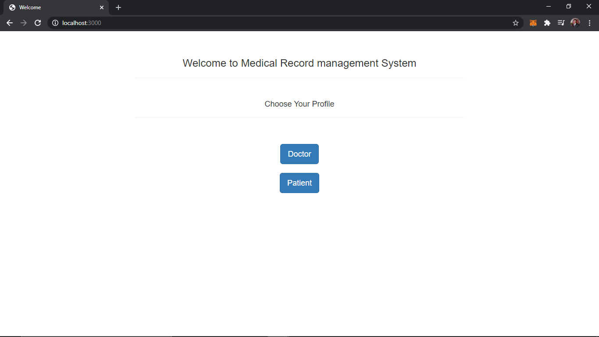
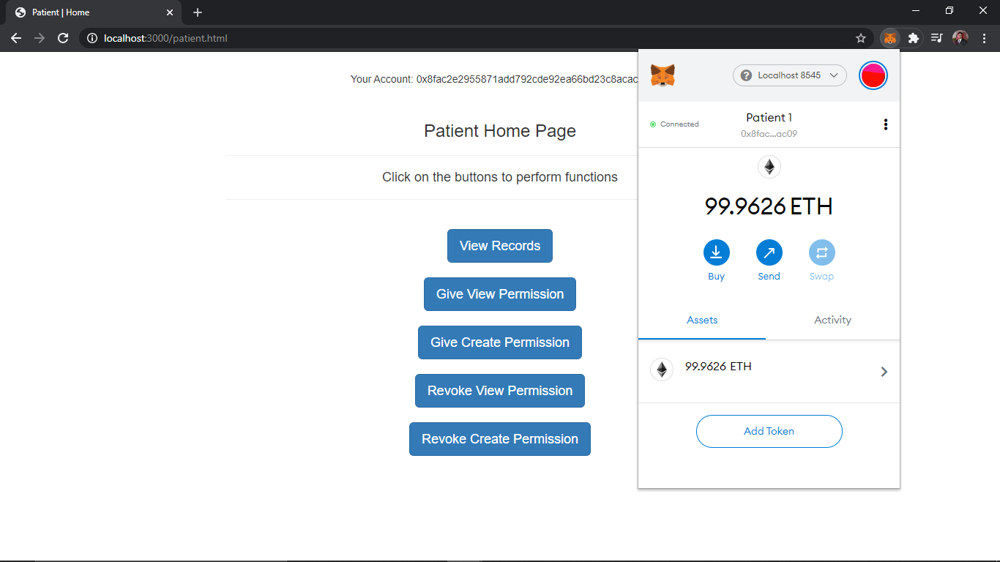
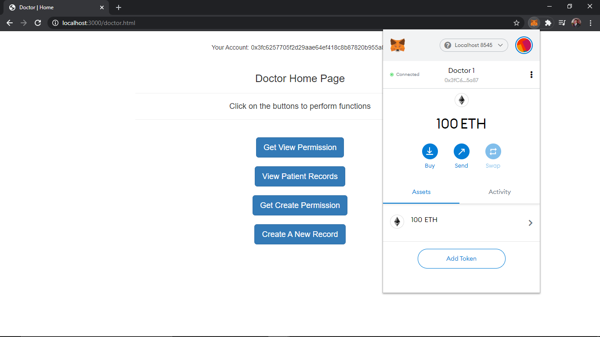
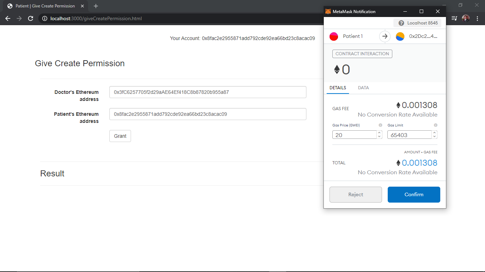
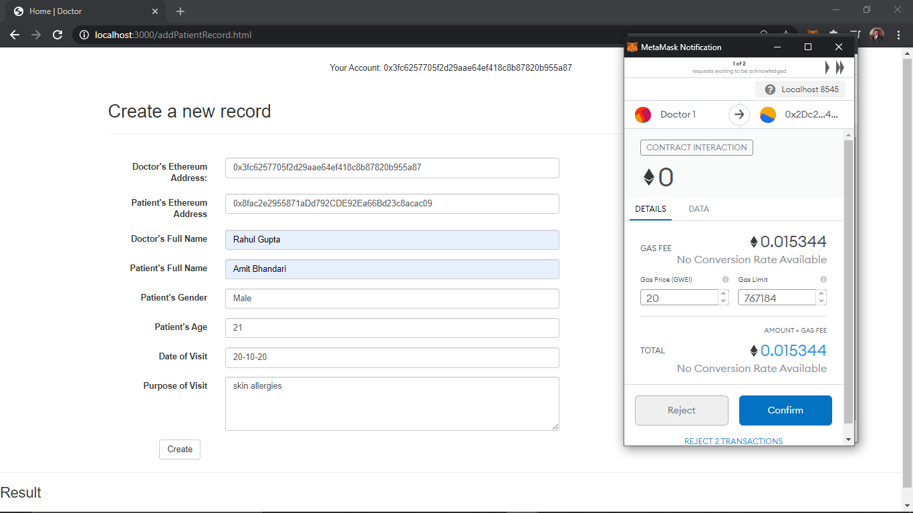
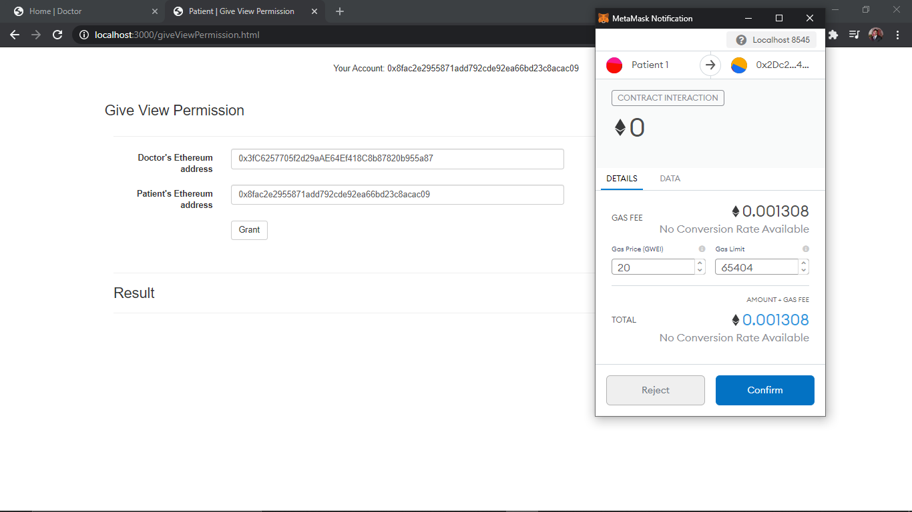
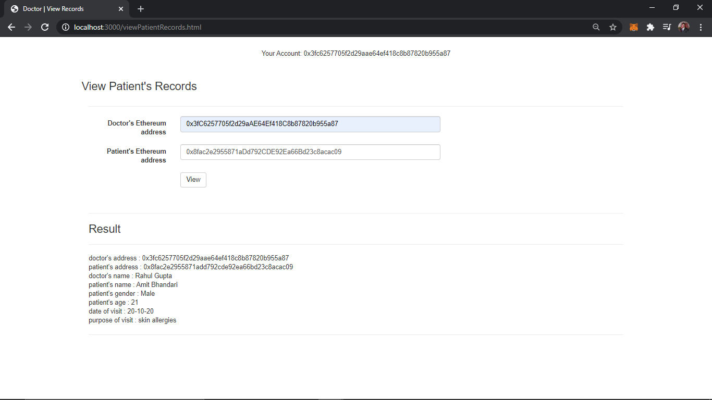

# Medical-Records-On-Blockchain
A DAPP for storing Medical records on the Blockchain using npm, Truffle, Ganache-cli, Web3.js Library.

# Pre-requisites
    npm
    truffle
    ganache
    web3.js

# Commands to run

    ganache-cli (in separate cmd)

    Move to project directory then run (in separate cmd):-
    
        truffle compile
        truffle migrate --reset
        npm run dev

# Configure metamask

    switch to localhost:8545
    import accounts from ganache using private keys
    Manually connect imported accounts if they don't connect automatically

# Debugging 

    Use browser's console(press f12) to see verbose results and errors

# User Interface

* By Clicking on the Patient Button you will be redirected to Patient Home page and also we need to configure our metamask to connect it to the localhost network->

* By Clicking on the Doctor Button you will be redirected to Doctor Home page and we need to connnect it to the doctor account to run it using Metamask ->

* To store the record of any patient the doctor has to take the permission of the patient and then the Doctor will be able to add the Patients Record->

* To view the record added, doctor has to take the view permission from the respective patient and then he will be able to see the record->

* Once the doctor has added one record the add record method will automatically revoke his permission so that he can't add more than one record at one time. 
* Patient will be able to his own records anytime from view records tab present on its home page. 
